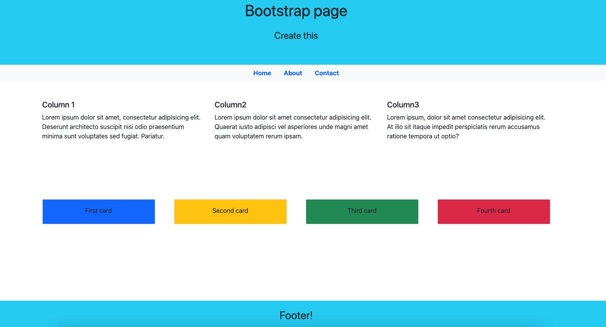

## Log in page or Sign in in

[Test this app yourself](https://maykaltenev.github.io/bootstrap-page/)

---

### About Project

This is a web page created with the Bootstrap library. It contains a banner, a navbar, a grid column layout, cards and a footer! Feel free to use as you please!
 

##### Developed With

- [x] _HTML5_
- [ ] _CSS3_
- [x] _SASS_
- [x] _SCSS_
- [x] _JavaScript_
- [ ] _React_
- [x] _Bootstrap_

---

### Contact

Mail: <michaeltenev@mail.com> 
GitHub: [michaeltenev](https://github.com/maykaltenev) 
LinkedIn: [Maykal Tenev](https://www.linkedin.com/in/maykal-tenev-a8729586/)

---

### Used Tools

- [npm](https://www.npmjs.com/)
- [Visual Studio Code](https://code.visualstudio.com/)

### Recourses

- [MDN Web Docs](https://developer.mozilla.org/de/)
- [Bootstrap](https://getbootstrap.com/)

---

Made with ❤️ by me
